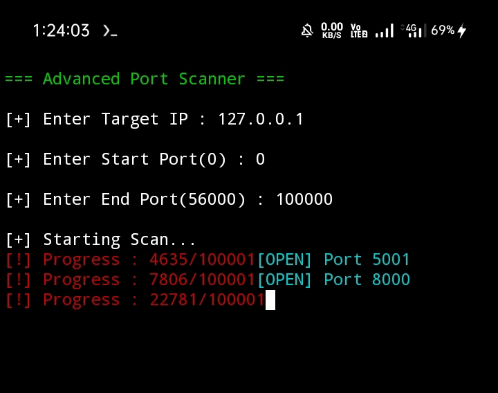
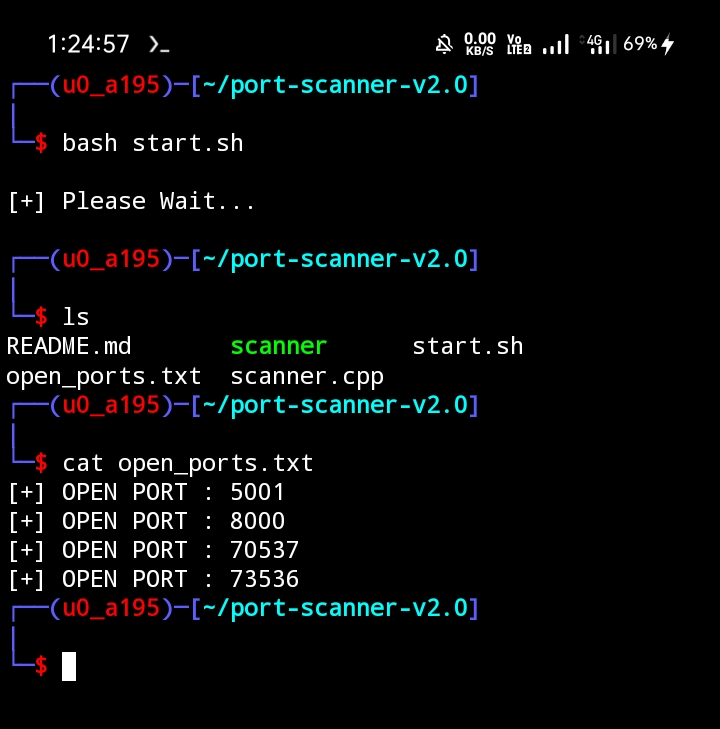

## Advanced Port Scanner C++

**A high-performance, multi-threaded TCP port scanner built in** **C++** for **Termux** **with a colorful hacker-style terminal UI, fast scanning engine, and professional console interface.**

---
---

### 🚀 Features

##### ⚡ Multi-threaded port scanning
##### 🎯 Custom port range scanning
##### 🖥 Hacker-style colorful terminal UI
##### 🌀 Loading spinner animation
##### 📊 Real-time progress tracking
##### 📁 Save open ports to file
##### 🧵 Thread pool for stability
##### ⚙ Optimized for high performance
##### 📱 Fully compatible with Termux
##### 💻 Lightweight and fast

---
---


### ✅ Demo & Screenshots


<br/><br/>
<br/><br/>


---
---

### 🖼 Interface

```bash
=== Advanced Port Scanner ===

Enter Target IP : 192.168.1.1
Start Port : 1
End Port : 1024

Starting scan...

[OPEN] Port 22
[OPEN] Port 80
[OPEN] Port 443

=== Scan Complete ===
Open Ports Saved To 'open_ports.txt' File.
```

---
---

### 📦 Requirements

Install dependencies in Termux:

```bash
pkg update
pkg upgrade
pkg install clang
pkg install ncurses
pkg install git
pkg install make
```

---
---

### 🛠 Installation

```bash
git clone https://github.com/ghsjulian/port-scanner-v2.0.git
cd port-scanner-v2.0
bash start.sh
```


---
---

### ⚙ Usage

##### 1. Enter target IP address
##### 2. Enter start port
##### 3. Enter end port
##### 4. Scanner will start
##### 5. Open ports will be displayed
##### 6. Results saved to `open_ports.txt`

---
---

### 📂 Project Structure

```bash
port-scanner-v2.0/
│
├── scanner.cpp
├── scanner 
├── README.md
├── open_ports.txt
├── start.sh
├── s1.jpg
└── s2.jpg
```

---
---

### 🧠 How It Works

##### - Uses TCP socket connections
##### - Multi-threaded scanning
##### - Queue-based port handling
##### - Ncurses for terminal UI
##### - Spinner animation for activity
##### - Automatic result saving

---
---

### ⚡ Performance

```bash
+---------------------------+
| Feature   |    Value      |
|-----------|---------------|
| Threads   |    200        |
| Timeout   |    1 sec      |
| Max Ports |    65535      |
| Platform  |    Linux      |
| Language  |    C++        |
| UI        |    Ncurses    |
+---------------------------+
```

---
---

### 🌐 Common Networking Ports


```bash
+----------------------------------------------------------------------+
|  Port  | Service / Protocol |     Description                        |
| -----  | ------------------ | -------------------------------------- |
|  20/21 |  FTP               | File Transfer Protocol (Data/Control)  |
|  22    |  SSH               | Secure Shell (Remote Login)            |
|  25    |  SMTP              | Simple Mail Transfer Protocol          |
|  53    |  DNS               | Domain Name System                     |
|  80    |  HTTP              | Hypertext Transfer Protocol (Web)      |
|  110   |  POP3              | Post Office Protocol (Email Receiving) |
|  143   |  IMAP              | Message Access Protocol (Email Sync)   |
|  443   |  HTTPS             | HTTP Secure (Encrypted Web)            |
|  587   |  SMTP (TLS)        | Secure Email Submission                |
|  993   |  IMAP (SSL)        | Secure Email Sync                      |
+----------------------------------------------------------------------+
```

---
---


### 🚀 Development & Database Ports

```bash
+--------------------------------------------------------------+
|   Port   |  Service / Tech  |     Typical Usage              |
| -------- | ---------------- | ------------------------------ |
|   3000   |  React / Node.js | Default Web Dev Port           |
|   3306   |  MySQL  | MySQL/ | MariaDB Database               |
|   5000   |  Flask / Express | Backend API Development        |
|   5432   |  PostgreSQL      | PostgreSQL Database            |
|   6379   |  Redis           | In-memory Data Store           |
|   8080   |  HTTP-Alt        | Common Web Proxy/Dev Port      |
|   27017  |  MongoDB         | NoSQL Database Port            |
+--------------------------------------------------------------+
```

---
---


### 📄 Output

**Open ports are saved in:**

```bash
open_ports.txt

[+] OPEN PORT : 22
[+] OPEN PORT : 80
[+] OPEN PORT : 443
[+] OPEN PORT : 8080
[+] OPEN PORT : 3306

```

---
---

### 🔒 Disclaimer

**This tool is for :**

##### - Educational purposes
##### - Networking learning
##### - Security research
##### - Ethical testing

**Do not scan systems without permission.**

---
---

### 🛡 Use Cases

##### - Network analysis
##### - Server monitoring
##### - Ethical hacking learning
##### - Cybersecurity practice
##### - Socket programming practice

---
---

### 👩‍💻 Programmer & Author

**Ghs Julian**  
##### Full Stack Developer
##### C++ | Networking | Linux | Termux
##### Web :  https://ghsresume.netlify.app
##### Email : ghsjulian@outlook.com 
##### WhatsApp : +8801302661227

---
---

### ⭐ Support Me

**If you like this project :**

##### - Star the repository
##### - Fork the project
##### - Contribute improvements

---
---

### 📜 License

#### MIT License

***Free to use and modify.***

---
---

### Happy Coding 👩‍💻
### Radhe Radhe 🌺❤️🙏 

---
---